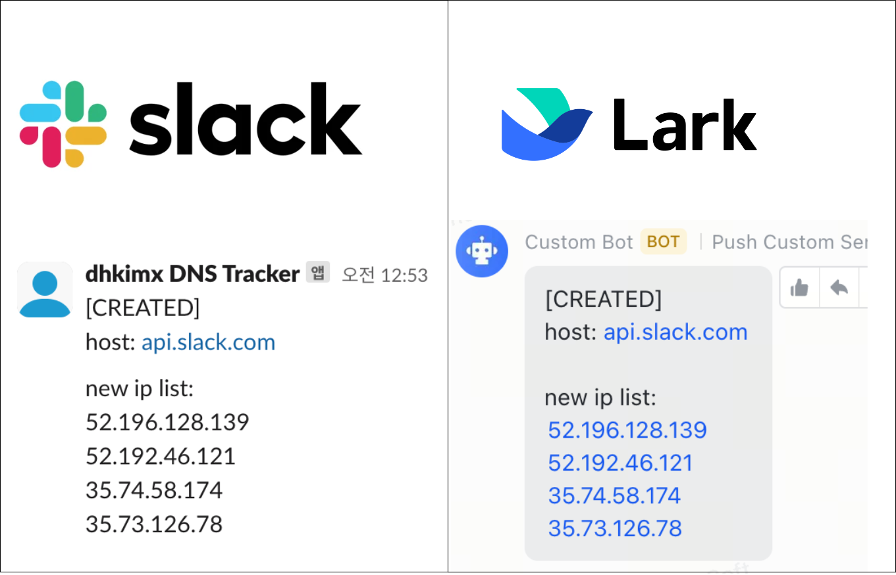

# DNS-Tracker



`DNS-Tracker` is a tool that tracks changes in the IP addresses of specified domains and notifies updates via `Slack` or `Lark`. It utilizes Redis for efficient data storage and is designed for easy deployment using Docker.

## Features
- Periodically tracks IP changes for specified domains
- Detects IP updates and sends notifications via Slack or Lark
- Uses Redis for fast and reliable storage
- Supports Docker deployment for easy setup
- Configurable settings via `config.yml`

### Notification Example
-  Created: When a new domain is added
```
[CREATED]  
host: example.com  

new ip list:
192.0.2.122
192.0.2.123
```

- Updated: When an existing domain's IP changes
```
[UPDATED]  
host: example.com  

deleted ip list:  
192.0.2.123  

added ip list:  
192.0.2.124 

total ip list:
192.0.2.122 
192.0.2.124
```


## Installation & Execution

### 1. Prerequisites

- Go 1.22.1
- Docker & Docker Compose
- Redis

### 2. Clone & Run  

  ```bash
  git clone https://github.com/dhkimxx/DNS-Tracker.git
  cd DNS-Tracker

  # You need to modify configuration file (./config.yml). Please refer to the contents below.
  # ex) vi config.yml
  docker-compose up -d --build
  ```

## Configuration
Modify `./config.yml` to customize the tracking domains and notification settings.
```yml
tracker:
  traking_hosts:
    - api.github.com
    - api.openai.com
    - api.slack.com

notifier:
  notifier_type: slack # [slack, lark, both] 'both' is option to notify on both Slack and Lark 
  slack:
    token: YOUR_SLACK_APP_TOKEN
    channel_ids:
      - YOUR_SLACK_CHANNEL_ID_1
      - YOUR_SLACK_CHANNEL_ID_2
  lark:
    webhook_url: YOUR_LARK_BOT_WEBHOOK_URL
```


## License
This project is licensed under the MIT License.

## Contributing
We welcome contributions!
1. Fork this repository
2. Create a new branch (git checkout -b feature/new-feature)
3. Commit your changes (git commit -m "Add new feature")
4. Push to your branch (git push origin feature/new-feature)
5. Open a Pull Request
